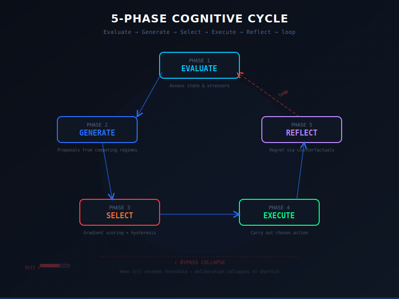
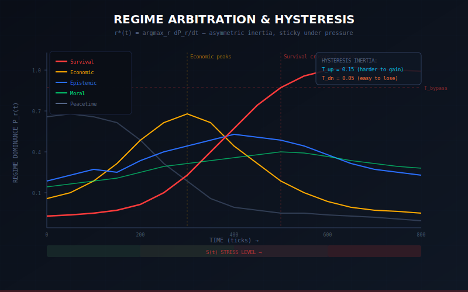
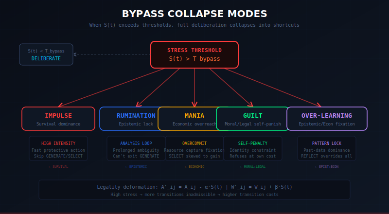

# Maelstrom Runtime

**Deterministic cognitive architecture that models volitional decision-making under stress and constraint — fully auditable, no randomness, no black boxes.**

<p align="center">
  
</p>

Most decision simulators are stochastic and opaque. Maelstrom is the opposite: a pure-Python, zero-dependency reference implementation of a 5-phase cognitive cycle where competing internal regimes (Survival, Moral, Economic, etc.) fight for control, legality deforms under pressure, bypass shortcuts (impulse, rumination, mania, guilt, over-learning) collapse deliberation when stress spikes, and regret is tracked via counterfactual archives.

Built to be replayable bit-for-bit. Survived 3,000,000-tick endurance runs with zero NaN/Inf, bit-perfect determinism across parallel runs, and bounded behavior under extreme stress.

**v2.2.0** — Python 3.12+ standard library only.

[](https://www.python.org/downloads/)
[](LICENSE)
[](https://github.com/adam-scott-thomas/maelstrom-runtime/commits/main)

---

## Try it in < 60 seconds

```bash
# Clone & install (editable mode)
git clone https://github.com/adam-scott-thomas/maelstrom-runtime.git
cd maelstrom-runtime
pip install -e .

# Run a minimal stress-ramp demo (watch regime flip + bypass trigger)
python examples/demo_runner.py examples/minimal_spec.json
```

> **Expected output:** Console trace showing EVALUATE → GENERATE → SELECT → EXECUTE → REFLECT cycle, regime scores, legality deformation, and eventual bypass collapse under rising stress.

<!-- TODO: Replace with actual GIF once recorded -->
<!--  -->
<!-- *Watch a minimal stress ramp trigger regime shift and impulse bypass (3-second loop)* -->

Want a live notebook?

[](#)

---

## Core Architecture (5-Phase Cycle)

<p align="center">
  
</p>
<p align="center"><em>Core loop: Evaluate → Generate → Select → Execute → Reflect</em></p>

### Six Competing Regimes

| Regime | Primary Driver | Typical Behavior under Stress |
|---|---|---|
| Survival | Threat / hazard | Fast, protective, bypass to impulse |
| Legal | Rules / institutional | Procedural caution, high penalty for deviation |
| Moral | Identity / conscience | Refusal even at cost, bypass to guilt |
| Economic | Opportunity / resource | Opportunistic capture, bypass to mania |
| Epistemic | Ambiguity / uncertainty | Analysis loops, bypass to rumination |
| Peacetime | Stability / default | Low-energy baseline |

Selection uses `r*(t) = argmax_r dP_r/dt` with inertia/hysteresis. Stress deforms legality:

```
A'_ij = A_ij - α·S(t)     # high stress → more transitions inadmissible
W'_ij = W_ij + β·S(t)     # high stress → higher transition cost
```

### Regime Arbitration & Hysteresis

<p align="center">
  
</p>
<p align="center"><em>Gradient scoring with asymmetric inertia — sticky under pressure</em></p>

### Bypass Collapse Modes

When stress crosses thresholds, full deliberation collapses into shortcuts:

<p align="center">
  
</p>
<p align="center"><em>Five collapse paths when S(t) exceeds T_bypass</em></p>

---

## Key Features

- **Perfect determinism** — identical seed → identical traces (proven over 1M+ ticks)
- **Full auditability** — Merkle-verified cycle traces, regret archives, per-regime scoring
- **Stress deformation** — legality & penalty weights warp continuously
- **Bypass mechanics** — documented collapse paths when deliberation fails
- **No external dependencies** — runs anywhere with Python 3.12+

---

## What's Open vs Proprietary

### Open in this repo

- Core cycle structure
- Regime arbitration math (hysteresis, gradient selection)
- Legality deformation formulas
- Bypass path definitions
- Basic regret model interface
- Determinism & stability test suite
- Minimal examples & runner

### Proprietary (not in this repo)

- Calibrated specialist scoring formulas
- Production w/u vectors
- Full scenario library
- Doctrine promotion evaluator
- Feedback rule engine thresholds
- Benchmark gating logic

---

## Project Layout

```
maelstrom/          Core engine
  types.py          Dataclasses, graph types, regime/bypass enums
  runtime.py        Main cycle loop
  regimes.py        Hysteresis & selection logic
  legality.py       A' / W' deformation
  bypasses.py       Collapse paths
  doctrine.py       Regret & counterfactual interface
  stressors.py      Basic stress vector generation
  utils.py          Hashing, deterministic RNG, helpers
tests/              Determinism, stability, semantics gates
examples/           Runnable demo specs
scripts/            Merkle recompute, trace export
docs/
  whitepaper.pdf    Full spec
  diagrams/         Architecture SVGs & PNGs
  merkle/           Integrity proofs
```

---

## Integrity & Verification

Recompute Merkle tree & verify traces:

```bash
python scripts/recompute_merkle.py
```

---

## Documentation

- Full technical whitepaper: [`docs/whitepaper.pdf`](docs/whitepaper.pdf)
- Change history: [`CHANGELOG.md`](CHANGELOG.md)

---

## License

**Proprietary** — see [LICENSE](LICENSE)

Want to discuss, fork for research, or contribute ideas?
Open an issue or reach out. Stars appreciated if this resonates.
